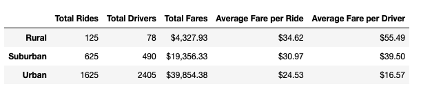
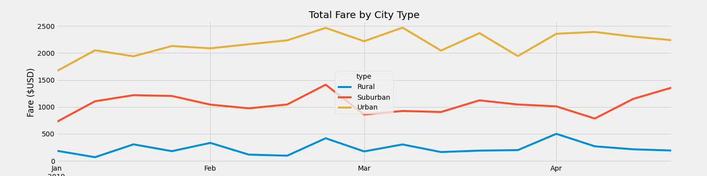

# PyBer_Analysis

## Overview
This analysis is for V. Isualize to review the ride-sharing data by city type. This report describes the variations of fares, city types, and drivers.
The city types are in the following categories:
* Urban
* Suburban
* Rural

As the city types are evaluated for fares and ride counts, there are significant variations between them which could impact future business decisions.

## Resources
The following resources were used to analyze the results:

* city_data.csv
* ride_data.csv

## Results
**Summary of PyBer Rides**
\

Observations:

* Urban Cities represent 81% of the total drivers, 68.4% of the total rides and 63% of the total fares.
* Suburban Cities represent 16% of the total drivers, 26% of the total rides and 30% of the total fares.
* Rural cities represent 3% of the total drivers, 5% of the total rides and 7% of the total fares.
* The drivers in Rural cities have substantially higher fares than that of Urban cities, but they have far fewer rides.
* For Rural and Suburban drivers, the Average Fare per Driver is favorable compared to the Average Fare per Ride. However, it is unfavorable for Urban drivers.
***
**FARES for January 2019 - April 2019**

Observations:

* Fares for all city types spiked in late February.
* For urban cities, fares were volatile throughout March.
* Rural cities had their highest peak at the start of April.

## Summary

The following recommendations are based on this analysis:
1. Manage the count of available drivers at any given time.
The number of drivers for the urban city types exceed the total rides. This could indicate a saturation of the urban cities with drivers who will earn less money per ride. To keep drivers happy about their pay, an idea would be to create a maximum available driver count based on ride demand.

2. Move drivers to other markets.
As peaks hit in rural and suburban cities, direct urban drivers to those areas for 

3. Re-evaluate fare rates in Urban cities.
The average fare per ride and driver is the lowest in urban cities. A market assessment with competitor rates may indicate an ability to increased fares. 
